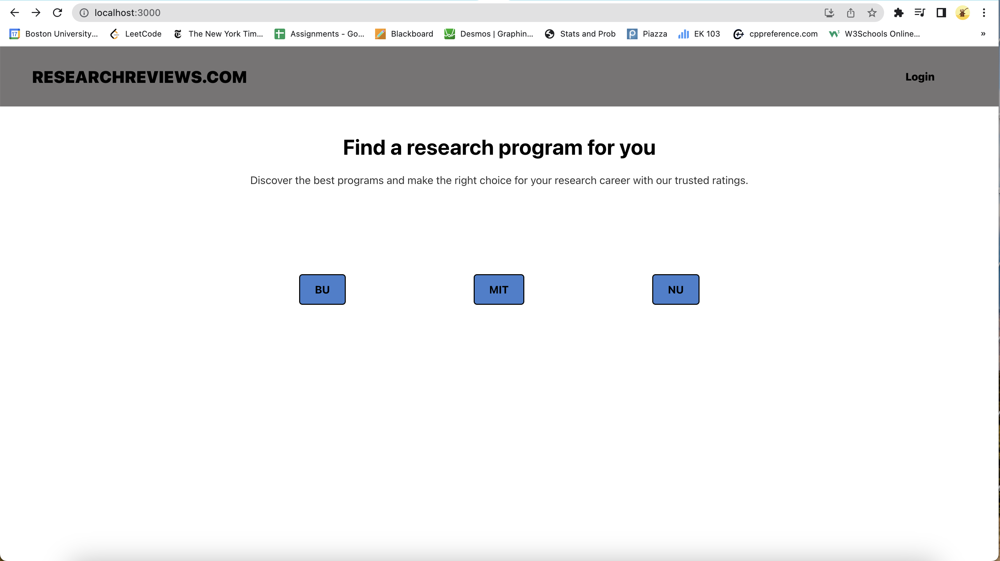

<!-- # ResearchRatings.com -->
[ResearchRatings.com](https://storied-syrniki-9241c1.netlify.app/)

  

### How to Use
To use the website, all you have to do is click here [ResearchRatings.com](https://storied-syrniki-9241c1.netlify.app/). There are no prerequisites.

## Overview
This is a web platform designed to help undergraduate students find and review research programs at their universities.  
  
The website aims to be a combination of "Rate My Professor" and "Glassdoor" for undergraduate research programs, allowing students to read and write reviews of research programs at their universities.

## Features
<!--### Program Search
Users can search for research programs based on a variety of criteria, including the university name, program name, research field, and location. The search results can be filtered and sorted by a number of different criteria, such as program rating, location, and research field.-->

### Program Reviews
Users can read reviews of research programs left by other students, and they can also leave their own reviews.   
  
Reviews can include information such as the quality of the research facilities, the mentorship provided by faculty, the level of support and resources available to students, and the overall experience of participating in the program.

### Program Ratings
Research programs are rated on a scale of 1-5 stars, based on the average rating of all the reviews left for the program.

### Use Cases
For more information, head to our Wiki to learn more about the use cases for this project

<!-- ### User Profiles
Users can create profiles on the website, which allows them to leave reviews, save programs to their favorites list, and connect with other students who have similar research interests. -->

<!-- ### Discussion Forums
Users can also participate in discussion forums related to undergraduate research programs, where they can ask questions, share their experiences, and connect with other students who are interested in research. -->

